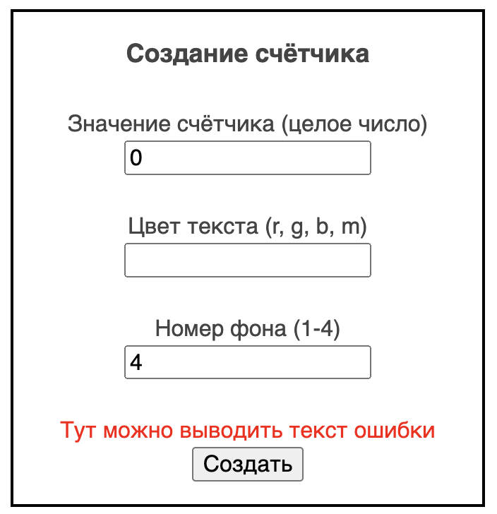
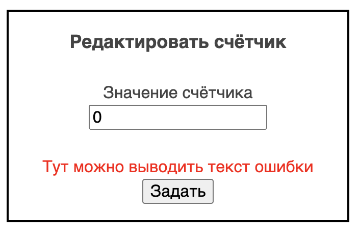

# Домашка до четверга, 1 марта

## Общий прогресс ДЗ
https://github.com/vshat-tms/homework-all

## Рекомендации по выполнению ДЗ
Если вам что-то непонятно в описании задачи, то задавайте вопросы в чате. Если вы видите в коде непонятные для вас конструкции, классы или методы - то гуглите их. Если вам нужен какой-то метод, но вы не знаете как он называется - гуглите. Если вы не знаете, как что-то сделать - гуглите. Если гугл вам не помог, то задавайте вопрос в чат. 

Чем более вы коммуникабельны, самостоятельны, проактивны, тем ценнее как специалист вы становитесь. Отвечая на вопросы в чате, вы структурируете у себя в голове и обучаетесь доносить информацию, с которой вы уже разобрались. 

## Что делать?
1. Форкнуть себе этот репозиторий
2. Выполнить задачи по проекту (ниже)
3. Сделать пулл реквест в этот репозиторий
4. Если в списке пулл реквестов вы увидите другие пулл реквесты (кроме вашего) - то зайдите в них и напишите "approve" в комментариях, если вы согласны с решением вашего коллеги. Оставьте комментарии к коду, если в чём-то не согласны.

## Требования к пулл реквесту
Имя пулл реквеста должно быть в формате:

`Homework-<Number> from <First Name> <Last Name>`

## Задачи

### Разбить один экран (Activity) на несколько
1. Посмотреть видео: [раз](https://www.youtube.com/watch?v=gwnVGQkGt88), [два](https://www.youtube.com/watch?v=NIYY1ARrW7s)
2. Создать `MenuActivity`. Она должна отображать текст "меню". В ней будут кнопки (`Button`), которые по клику будут открывать (`startActivity`) другие экраны.
3. В манифесте (`AndroidManifest.xml`) сделать так, чтобы при запуске приложения открывалась `MenuActivity`, а не `MainActivity`. Для всех активити в манифесте всегда указывайте `android:label`. Текст в этом атрибуте будет отображаться в заголовке экрана.
4. Добавить в меню кнопку `main`, которая будет открывать `MainActivity`
5. Из `MainActivity` перенести кнопки и код, который отвечает за отображение животных в новую активити. Добавить в меню кнопку, которая бы открывала эту активити.
6. Перенести секцию `Info` (device, time, toast) в новую активити (и добавить кнопку в меню).
7. Переименовать `MainActivity` в `CounterActivity`, `activity_main.xml` в `activity_counter.xml`

### Передача данных в activity
1. Посмотрите [видео](https://www.youtube.com/watch?v=-YV0KIB6ca4)
1.  Создайте `CreateCounter` activity. На этом экране можно будет задать параметры для счётчика.
2. Создайте форму для ввода параметров счётчика, используя `LinearLayout`, `EditText`, `Button`, `TextView`.
Форма может выглядеть как угодно. Главное, чтобы можно было ввести необходимые параметры.
3. При нажатии на кнопку, должен открываться экран счётчика с заданным значением, цветом текста и фоном.
4. Нужно добавить обработку ошибок. Например, значение счётчика не может быть строкой.
   
**Пример экрана:**

### Жизненный цикл  Activity
1. Посмотрите [видео](https://www.youtube.com/watch?v=vv9w9_l17z4)
2. Добавьте во все ваши активити логирование методов жизненного цикла (`onCreate`, `onStart`, ...). Если какого-то метода (из показанных в видео) нет, то переопределите его.
3. Изучайте логи при запуске, сворачивании, остановке приложения и открытии новых активити (из меню, например)
4. Посмотрите [видео](https://www.youtube.com/watch?v=lynYXGzefI0)
5. Ещё раз выполните пункт 3.
6. Посмотрите [видео](https://www.youtube.com/watch?v=lynYXGzefI0)
7. Если какое-то видео непонятно, то возьмите перерыв и посмотрите ещё раз.

### Сохранение данных между поворотами экрана
1. Прочитайте [теорию](https://www.fandroid.info/povtornoe-sozdanie-deyatelnosti/)
2. Для каждой активити нужно сохранять её состояние между поворотами (для счётчика - значение, цвет, фон; для животных - выбранное животное и поворот; и т.п.)

### Запуск активити для получения результата
1. Посмотрите [видео](https://www.youtube.com/watch?v=t6dlqZH60fk)
1. На экран со счётчиком добавьте кнопку "Редактировать". При нажатии на эту кнопку должен открываться экран, на котором можно отредактировать текущее значение счётчика. На этом экране должна быть кнопка "задать", при нажатии на которую вы возвращаетесь на предыдущий экран (счётчика), а значение при этом изменено. 

**Пример экрана:**

3. Посмотрите [видео](https://www.youtube.com/watch?v=fSLeoTLRMdg)
 

4. (*Усложнённое задание. Выполнять не обязательно*) Сделайте возможность запускать `CreateCounterActivity` через `startActivityForResult`. Т.е. если `CreateCounterActivity` было запущена таким способом,то при нажатии на кнопку создать оно возвращает результат и закрывается, вместо того, чтобы запускать активити со счётчиком. Добавьте в меню кнопку "create counter (for result)" в которая будет запускать `CreateCounterActivity` такиим способом, а когда получит ответ, то запустит `CounterActivity` с необходимым параметром. 

### Запуск активити, не находящихся в вашем приложении
1. Посмотрите [видео](https://www.youtube.com/watch?v=32D17w-EfSc)
2. Добавьте экран, на котором будут кнопки, которые запускают разные приложения. Этот экран должен открываться из меню приложения.

### Функция "Поделиться" (share)
1. На экран со счётчиком добавьте кнопку share. Она должна "делиться" текущим значением счётчика. Пример реализации: [ссылка](https://stackoverflow.com/a/9948549). Убедитесь, что этот текст появляется в том приложении, которое выберет пользователь. Например, в приложении "Сообщения" в эмуляторе.
2. Создайте активити, которая бы появилась в списке "поделиться" вместе с системными. Пример реализации: [ссылка](https://stackoverflow.com/a/55037335). Эта активити в манифесте должна иметь атрибут `android:exported="true"`. Убедитесь, что она отображается при нажатии "поделиться" в других приложениях (и в вашем - пункт 1). Эта активити должна отображать текст, которым "поделились".
